# Socially — dokumentacja techniczna projektu

## 1. Opis aplikacji i cel biznesowy

Socially to aplikacja frontendowa wspierająca społeczność użytkowników wokół wydarzeń lokalnych.  
Główne cele:

- umożliwienie użytkownikowi szybkiego odkrywania wydarzeń na mapie i liście,
- obsługa pełnego cyklu udziału w wydarzeniu (od znalezienia do dołączenia lub rezygnacji),
- wsparcie roli organizatora (tworzenie wydarzeń, zarządzanie zasadami dołączania, moderacja zgłoszeń),
- budowanie wiarygodności użytkowników przez profile, relacje znajomych, grupy i recenzje.

## 2. Zakres funkcjonalny i widoki

Poniżej opisano dokładny zakres odpowiedzialności każdego widoku oraz dostępne akcje użytkownika.

## 2.1 Strefa publiczna (bez aktywnej sesji)

### Login (`/login`)

**Funkcje wejściowe**

- logowanie przez Firebase Authentication z użyciem email/hasło,
- wybór trwałości sesji (`persistent`/`session`) z mapowaniem na „remember me”,
- obsługa parametru `returnTo` umożliwiająca powrót do chronionego zasobu.

**Funkcje walidacyjne i błędy**

- walidacja wymaganych pól formularza,
- blokada submit podczas trwającego żądania.

**Efekt biznesowy**

- utworzenie sesji auth i wejście do obszaru prywatnego bez utraty kontekstu nawigacji.

**Zrzut ekranu**

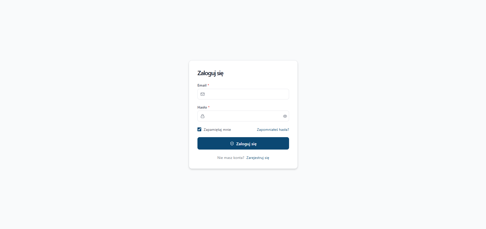
_Widok logowania_

### Registration (`/register`)

**Funkcje wejściowe**

- rejestracja nowego użytkownika przez Firebase,
- automatyczne ustawienie preferencji trwałości sesji po poprawnej rejestracji.

**Funkcje walidacyjne**

- walidacja imienia i nazwiska (minimalna/maksymalna długość),
- walidacja formatu email,
- walidacja złożoności hasła (uppercase, digit, znak specjalny, min. 8),
- walidacja zgodności hasła i potwierdzenia,
- walidacja wymaganej zgody formalnej.

**Efekt biznesowy**

- utworzenie konta i natychmiastowe przejście do strefy zalogowanej.

**Zrzut ekranu**

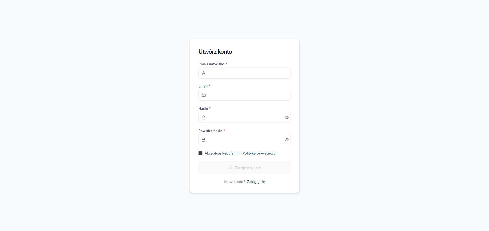
_Widok rejestracji._

## 2.2 Strefa chroniona (`AuthGuard`)

`AuthGuard` odpowiada za integralność dostępu:

- brak sesji -> przekierowanie do `/login?returnTo=...`,
- aktywna sesja -> render widoków chronionych,

## 2.3 Discover (`/discover`) — główny widok aplikacji

**Funkcje eksploracji**

- równoległa prezentacja wydarzeń na mapie i liście,
- selekcja wydarzenia przez marker mapy lub element listy,
- synchronizacja stanu zaznaczenia i przewijanie listy do aktywnego elementu.

**Funkcje filtrowania**

- tekst (wyszukiwanie), kategorie, cena, zakres dat,
- tryb "Tu i teraz" uruchamiający geolokalizację i filtr na start w ciągu najbliższych 2h.

**Funkcje nawigacyjne**

- przejście do szczegółów wydarzenia,
- przejście do profilu organizatora.

**Zrzut ekranu**

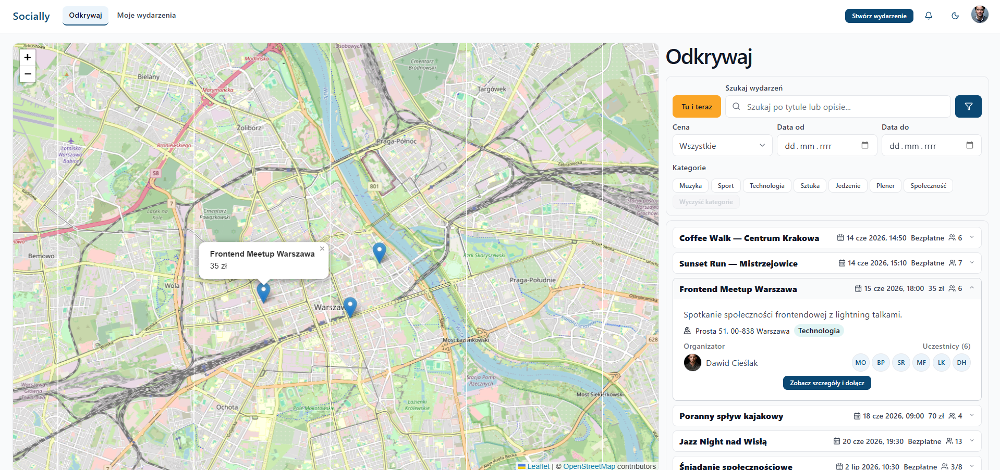
_Główny ekran widoku Eksploruj: mapa, filtry i lista wydarzeń._

## 2.4 Event Details (`/events/:eventId`)

**Funkcje informacyjne**

- pełna karta wydarzenia: dane czasu, miejsca, ceny, organizatora,
- lista uczestników z nawigacją do profili.

**Funkcje uczestnictwa**

- dołączenie do wydarzenia,
- opuszczenie wydarzenia,
- obsługa stanu `pending` dla wydarzeń moderowanych.

**Funkcje organizatora**

- jeśli aktualny użytkownik jest organizatorem: skrót do panelu zarządzania wydarzeniem.

**Zrzuty ekranu**

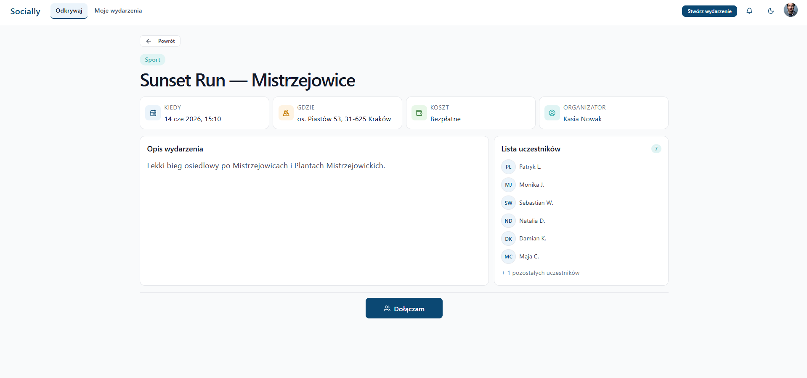
_Widok szczegółów wydarzenia z danymi i sekcją uczestników._


_Widok szczegółów wydarzenia ze zdjęciem._

## 2.5 Create Event (`/events/create`)

**Funkcje formularza**

- tworzenie wydarzenia z pełnym zestawem pól biznesowych:
  - tytuł, opis, data/czas, kategoria,
  - cena (darmowe/płatne, koszt),
  - pojemność (bez limitu/limit, wartość limitu),
  - lokalizacja i adres.

**Funkcje geolokalizacyjne**

- wyszukiwanie adresu (geokodowanie),
- wybór miejsca na mapie (reverse geocoding),
- mapowanie pozycji geograficznej na strukturę adresową.

**Funkcje walidacyjne**

- walidacja minimalnych długości i wymaganych pól,
- walidacja spójności ceny i pojemności,
- walidacja kompletności lokalizacji.

**Zrzuty ekranu**

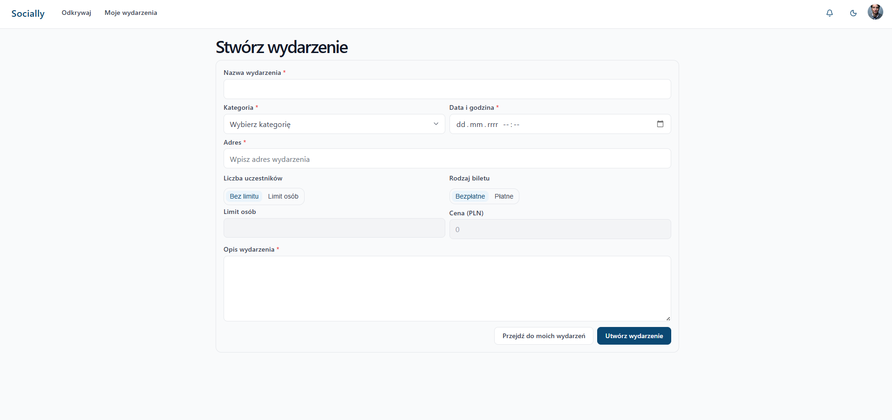
_Formularz tworzenia wydarzenia._

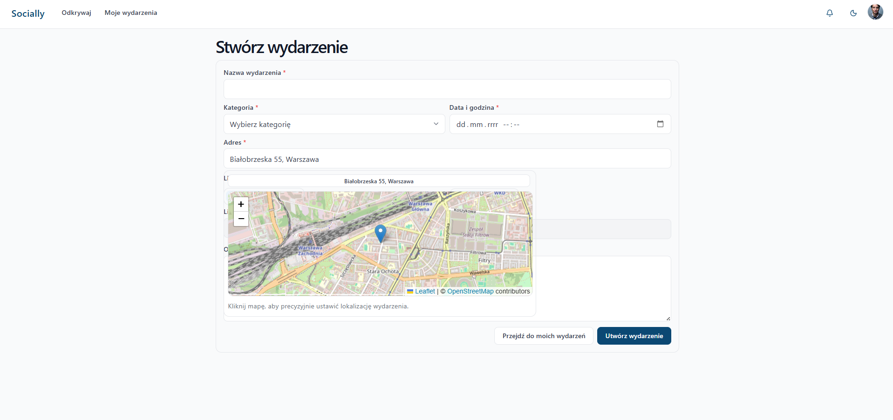
_Wybór lokalizacji wydarzenia z geokodowaniem i mapą._

## 2.6 My Events (`/my-events`)

**Listy**

- lista wydarzeń organizowanych przez zalogowanego użytkownika,
- lista wydarzeń, w których użytkownik uczestniczy.

**Akcje**

- przejście do detali wydarzenia,
- przejście do zarządzania wydarzeniem autora,
- opuszczenie wydarzenia uczestniczonego.

**Zrzut ekranu**

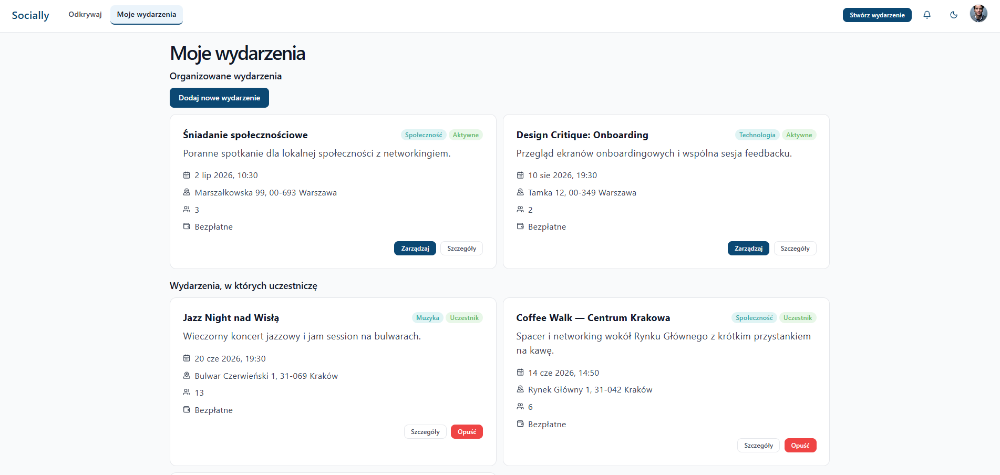
_Widok Moje Wydarzenia z sekcją wydarzeń organizowanych i sekcją uczestnictwa._

## 2.7 Manage Event (`/my-events/:eventId/manage`)

**Funkcje podglądu i kontroli**

- podsumowanie danych wydarzenia,
- podgląd uczestników i limitu,
- podgląd aktywnych reguł dołączania.

**Funkcje edycji wydarzenia**

- modal aktualizacji szczegółów wydarzenia,
- walidacja pojemności i reguł aktualizacji (nie można zmiejszyć limitu),
- geokodowanie/reverse geokodowanie podczas zmiany lokalizacji.

**Funkcje moderacyjne**

- zarządzanie regułami dołączania (`ZNAJOMI`, `GRUPA`, `PUBLICZNY`, konieczność zatwierdzania),
- obsługa kolejki próśb: akceptacja lub odrzucenie,
- przejścia do profili uczestników i wnioskujących.

**Zrzuty ekranu**

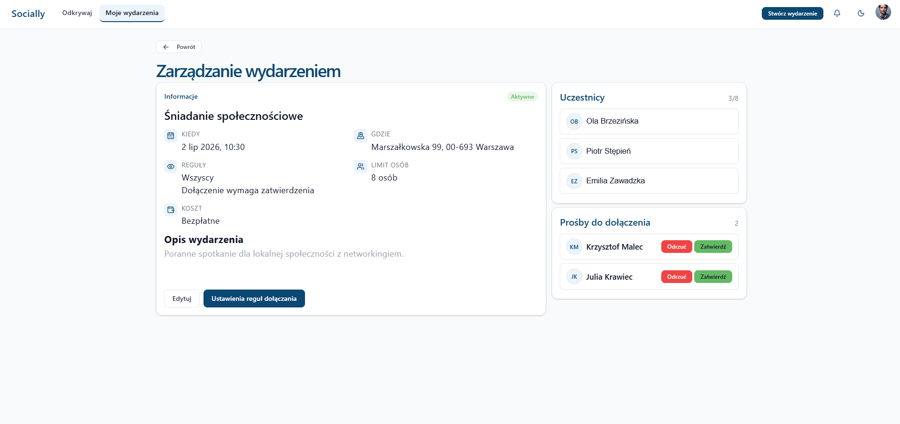
_Panel zarządzania wydarzeniem - dane, uczestnicy, prośby o dołączenie._

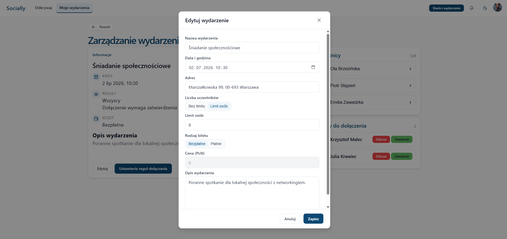
_Okno edycji szczegółów wydarzenia._

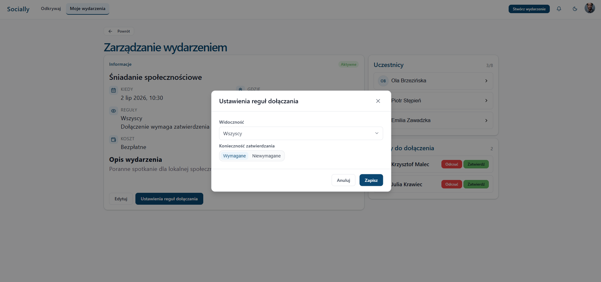
_Okno konfiguracji reguł dołączania do wydarzenia._

## 2.8 Notification Center (`/notifications`)

**Funkcje widoku**

- pobranie listy powiadomień użytkownika,
- grupowanie po okresie czasu,
- oznaczanie statusu odczytu.

**Funkcje nawigacji**

- przekierowanie do profilu użytkownika,
- przekierowanie do szczegółów wydarzenia.

**Zrzut ekranu**

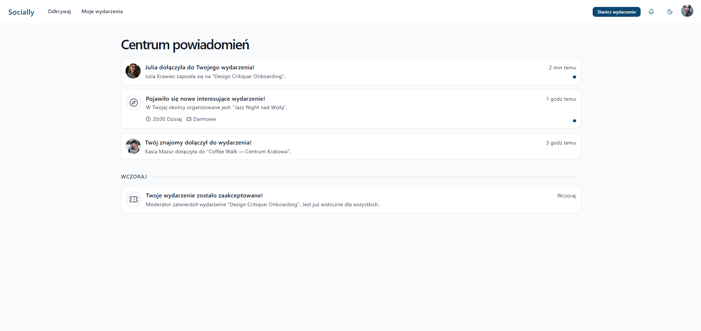
_Widok powiadomień._

## 2.9 My Profile (`/profile`)

**Funkcje profilu**

- podgląd własnych danych i statusu profilu,
- edycja danych profilu w dialogu,
- akcja zatwierdzenia profilu.

**Funkcje społecznościowe**

- lista znajomych,
- lista przychodzących zaproszeń,
- akceptacja i odrzucanie zaproszeń,
- lista grup użytkownika.

**Zrzuty ekranu**

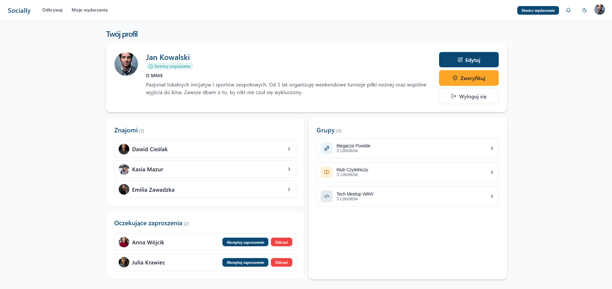
_Widok własnego profilu z sekcjami społecznościowymi._

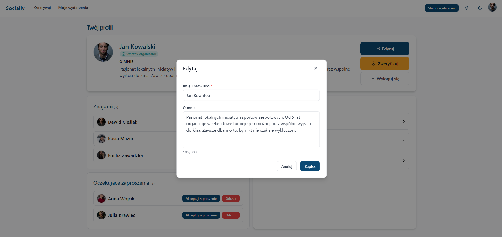
_Okno edycji danych profilu użytkownika._

## 2.10 Public Profile (`/users/:userId`)

**Funkcje reputacyjne**

- podgląd recenzji, ratingu i danych użytkownika.

**Funkcje relacyjne**

- wysłanie zaproszenia do znajomych,
- akceptacja/odrzucenie zaproszenia,
- usunięcie relacji znajomych.

**Funkcje odkrywania społeczności**

- wspólni znajomi,
- grupy użytkownika.

**Zrzuty ekranu**

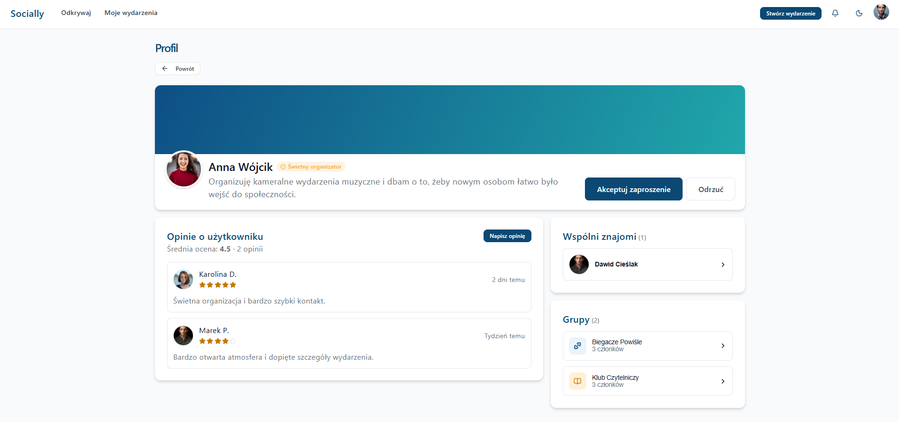
_Widok profilu publicznego z relacjami i sekcją ocen._

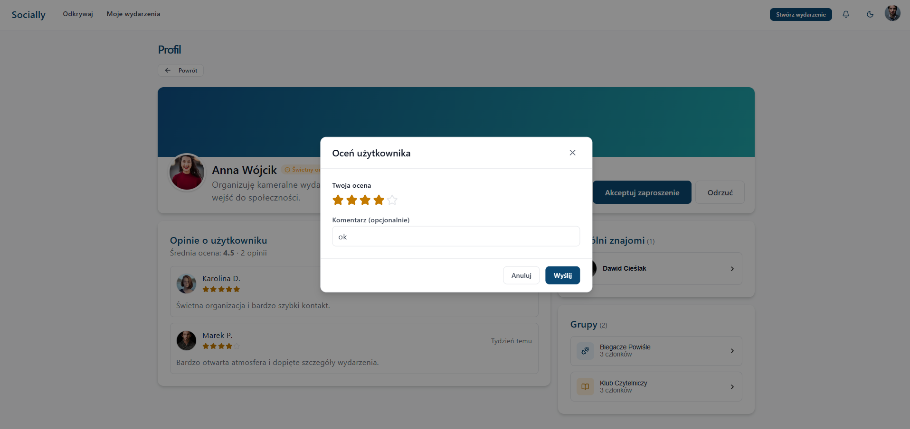
_Onko wystawiania opinii użytkownikowi._

## 2.11 Group Details (`/groups/:groupId`)

**Funkcje grupowe**

- podgląd szczegółów grupy,
- dołączenie/opuszczenie grupy,

**Funkcje powiązane**

- przejścia do profili członków.

**Zrzut ekranu**

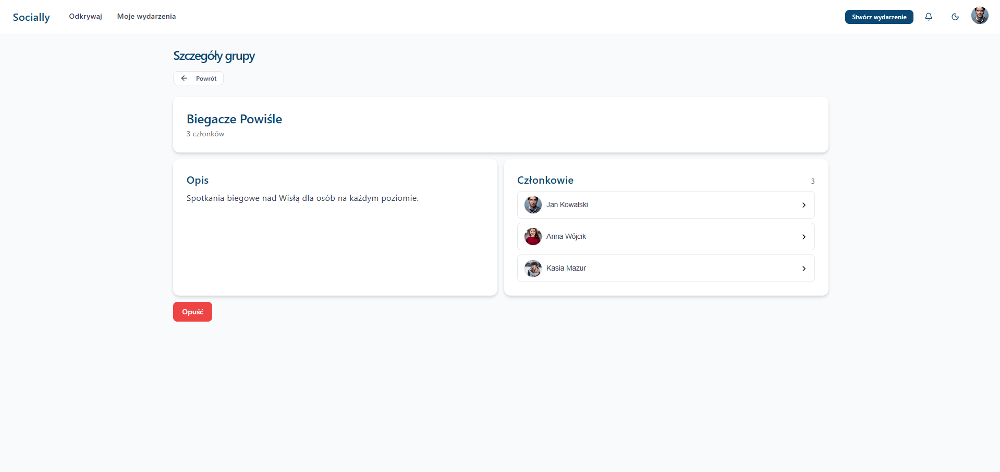
_Widok szczegółów grupy._

## 2.12 Nawigacja globalna i komponenty przekrojowe

- globalny `AppNavbar` aktywny w całym obszarze zalogowanym,
- szybkie wejścia do kluczowych przepływów domenowych,
- menu profilu z akcją logout,
- wspólny system toastów dla operacji asynchronicznych i błędów.

## 2.13 Obsługa ciemnego motywu (Dark Theme)

**Funkcje motywu**

- aplikacja obsługuje tryb jasny i ciemny w całym obszarze UI,
- przełączanie motywu jest dostępne globalnie przez komponent `ThemeToggle`,
- wybrany motyw jest zapisywany lokalnie i odtwarzany przy kolejnym uruchomieniu,
- przy braku wyboru użytkownika stosowany jest tryb systemowy.

**Zrzut ekranu**

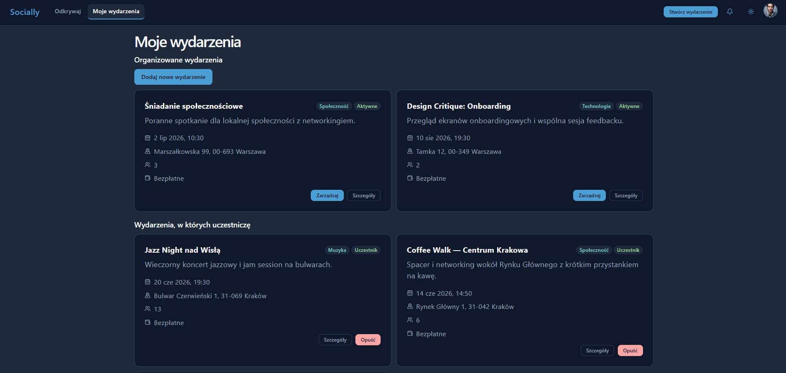
_Przykład widoku aplikacji w trybie ciemnym (Moje wydarzenia)._

## 3. Architektura techniczna

## 3.1 Stack i biblioteki

- **Framework UI:** React 19,
- **Bundler/dev server:** Vite,
- **Język:** TypeScript (TS/TSX),
- **Routing:** `react-router-dom`,
- **State management:** Redux Toolkit + `react-redux`,
- **Walidacja kontraktów:** `zod`,
- **Mapy:** `leaflet`, `react-leaflet`, `react-leaflet-cluster`,
- **Analityka:** `react-ga4` + skrypt ContentSquare,
- **Autoryzacja:** Firebase Auth,
- **Testy:** Jest + Testing Library (`jsdom`),
- **Linting:** ESLint.

## 3.2 Integracje zewnętrzne i providerzy statyk

### Firebase

- moduł `src/firebase/config.ts` odczytuje wymagane zmienne `VITE_FIREBASE_*`,
- moduł `src/firebase/app.ts` inicjalizuje singleton aplikacji Firebase,
- moduł `src/firebase/auth.ts` dostarcza instancję `getAuth`,
- auth flow aplikacji jest oparty o adapter `pages/auth/api/authApi.ts`.

### Google Analytics 4

- inicjalizacja w `src/main.tsx` na podstawie `VITE_GA_MEASUREMENT_ID`,
- śledzenie page view dla SPA realizowane przez `PageTracker` w `src/App.tsx`.

### ContentSquare (historycznie Hotjar)

- skrypt ładowany globalnie w `app/index.html`,
- integracja działa niezależnie od logiki routingowej aplikacji.

### OpenStreetMap / Nominatim

- mapy bazują na OpenStreetMap,
- geokodowanie i reverse geokodowanie realizowane przez endpointy Nominatim (w warstwie mock handlerów event management).

## 3.3 Warstwa API i kontrakty danych

Wszystkie wywołania transportowe przechodzą przez `requestContract` (`src/app/apiContractGateway.ts`), co daje:

- walidację payloadu requestu przez `zod` przed wysłaniem,
- walidację odpowiedzi przez `zod`,
- spójny model błędów oparty o klucze tłumaczeń (request validation, HTTP status, response validation, network),
- jawne przekazywanie tokenu Authorization.

To podejście minimalizuje rozjazd między modelem domenowym a dto.

## 3.4 Mockowanie danych (MSW) i granica backendu

### Uruchamianie

- worker MSW startuje przy `DEV` lub `VITE_ENABLE_MSW=true`,
- konfiguracja znajduje się w `src/mocks/browser.ts` oraz `src/main.tsx`.

### Organizacja handlerów

Handlery są podzielone domenowo:

- `mocks/auth`,
- `mocks/discover`,
- `mocks/event-management`,
- `mocks/profile`,
- `mocks/notifications`,
- `mocks/groups`.

### Zakres mockowanych zachowań

- autoryzacja i mapowanie użytkownika na podstawie tokenu,
- filtrowanie discover po kryteriach query,
- model uczestnictwa (`joined` / `pending`) i reguły join,
- tworzenie/edycja wydarzeń oraz moderacja próśb,
- relacje społeczne (friend requests, unfriend),
- grupy i członkostwo,
- powiadomienia oraz oznaczanie odczytu.

## 3.5 Redux: model stanu i odpowiedzialności slice’ów

Store (`src/redux/store.ts`) obejmuje sześć slice’ów:

1. **`auth`**
   - sesja użytkownika,
   - bootstrap sesji,
   - preferencja trwałości sesji,
   - statusy login/register/logout.
2. **`discover`**
   - lista wydarzeń i wybrane wydarzenie,
   - zestaw filtrów,
   - stan geolokalizacji i pozycja użytkownika,
   - asynchroniczne pobieranie listy discover.
3. **`eventManagement`**
   - wydarzenia autora, wydarzenia uczestniczone,
   - tworzenie i aktualizacja wydarzeń,
   - reguły dołączania,
   - operacje join/leave,
   - obsługa requestów dołączenia.
4. **`profile`**
   - `myProfile` i `publicProfile`,
   - aktualizacja profilu,
   - recenzje,
   - relacje znajomości (request/accept/reject/unfriend).
5. **`groups`**
   - szczegóły grupy,
   - join/leave,
   - odświeżanie zależnych danych profilowych po zmianie członkostwa.
6. **`notificationCenter`**
   - pobranie listy powiadomień,
   - aktualizacja `isRead`.

Każdy slice utrzymuje statusy asynchroniczne, klucze błędów i identyfikatory requestów do ochrony przed race condition.

## 3.6 Architektura UI i design system

### Komponenty współdzielone

Katalog `src/shared/components` zawiera komponenty bazowe i przekrojowe, m.in.:

- formularze (`TextField`, `PasswordField`, `TextArea`, `Dropdown`, `DateField`, `DateTimeField`),
- akcje (`Button`, `SegmentedToggle`),
- kontenery (`Card`, `Modal`, `Accordion`),
- nawigacja i shell (`TopNav`, `AppNavbar`, `ThemeToggle`),
- komunikaty (`NotificationProvider`, hook `useNotifications`),
- elementy tożsamości (`Avatar`, `Badge`).

### Prymitywy layoutu

`src/shared/layout` dostarcza spójny model kompozycji:

- `Page`, `Section` dla struktury strony,
- `Stack`, `Cluster`, `Split`, `Grid` dla layoutu i responsywności.

### Tokeny i motyw

- tokeny primitive i semantic ładowane globalnie (`tokens/primitive.css`, `tokens/semantic.css`),
- ustawienie motywu wstępnie rozstrzygane w `index.html` przed startem React.

## 3.7 Struktura repozytorium

```text
socially-app/
├─ app/
│  ├─ package.json
│  ├─ index.html
│  ├─ src/
│  │  ├─ main.tsx                # bootstrap aplikacji, tokeny, MSW, GA
│  │  ├─ App.tsx                 # root composition: Provider + Router + tracking
│  │  ├─ app/                    # gateway kontraktów API
│  │  ├─ firebase/               # konfiguracja i adapter auth
│  │  ├─ i18n/                   # tłumaczenia i funkcja t()
│  │  ├─ mocks/                  # MSW handlers i store danych mockowanych
│  │  ├─ pages/                  # moduły funkcjonalne per domena
│  │  ├─ redux/                  # store + slice’y
│  │  ├─ shared/                 # komponenty i layout współdzielony
│  │  └─ tokens/                 # tokeny design systemu
│  └─ ...
└─ README.md
```

## 4. Uruchomienie lokalne i komendy

Wszystkie komendy frontendowe uruchamiane są w katalogu `app/`.

```bash
cd app
npm install
npm start
```

### Kluczowe skrypty

```bash
npm run build
npm test -- --watchAll=false
npm test -- --watchAll=false --runTestsByPath src/__tests__/tokens.test.ts
npm run lint
```

## 5. Konfiguracja środowiska

Należy utworzyć plik `.env` na podstawie `.env.example`.

Wymagane zmienne:

- `VITE_FIREBASE_API_KEY`
- `VITE_FIREBASE_AUTH_DOMAIN`
- `VITE_FIREBASE_PROJECT_ID`
- `VITE_FIREBASE_APP_ID`

Opcjonalnie:

- `VITE_ENABLE_MSW` — wymusza uruchomienie mock service workera poza DEV,
- `VITE_GA_MEASUREMENT_ID` — włącza GA4.

## 6. Przepływ danych (end-to-end)

Typowy scenariusz w aplikacji:

1. Komponent widoku dispatchuje thunk z odpowiedniego slice’a.
2. Thunk pobiera token i wywołuje funkcję API.
3. Funkcja API deleguje request do `requestContract`.
4. `requestContract` waliduje request/response i zwraca dane typu DTO.
5. Slice aktualizuje stan (`items`, `status`, `errorKey`).
6. UI renderuje stan docelowy lub komunikaty błędów przez klucze i18n.

Ten sam kontrakt działa dla realnego backendu i dla MSW, dzięki czemu można testować zachowanie warstwowe bez zmiany kodu widoków.

## 7. Testy

Zestaw testów:

- **32 pliki testowe** (`*.test.ts` / `*.test.tsx`),
- **406 przypadków testowych** (`it`/`test`),
- **112 bloków `describe`**.

### 8.1 Pokrycie testami

1. **Auth**
   - adapter Firebase (`login`, `register`, `logout`, persistence),
   - bootstrap sesji i zachowanie routingu auth/public/private,
   - zachowanie `returnTo` i walidacje formularzy.
2. **Discover i event flow**
   - zachowanie filtrów i stanów listy discover,
   - mechanika „here now” i utilsy geolokalizacyjne,
   - przejścia discover -> event details -> profile,
   - przepływy udziału w wydarzeniach (`join`/`leave`/`pending`).
3. **Event management**
   - logika store wydarzeń,
   - tworzenie i zarządzanie wydarzeniem (w tym reguły join i moderacja requestów),
   - poprawność przejść między widokami operacyjnymi.
4. **Profile i relacje społeczne**
   - render i stany widoków `my profile` / `public profile`,
   - akcje friend request (`send`, `accept`, `reject`, `unfriend`),
   - interakcje profile <-> groups.
5. **Groups i notifications**
   - mechanika członkostwa w grupach,
   - powiązane odświeżanie stanu po mutacjach.
6. **Design system i layout**
   - komponenty shared (`Button`, `Modal`, `TextField`, `TopNav`, `AppNavbar`, itp.),
   - prymitywy layoutu,
   - tokeny i hook motywu.

### 8.2 Typy testów

Suite jest oparty głównie o:

- **testy jednostkowe** (helpery, utilsy, adaptery),
- **testy integracyjne UI** (React Testing Library + `jsdom`),
- **testy przepływów domenowych** z mockowanym transportem.

## 9. Deploy

Aplikacja jest hostowana na Railway:

- konfiguracja Vite dopuszcza hosty `*.up.railway.app` dla `server` i `preview`,
- build produkcyjny realizowany przez `npm run build`,
- artefakt to statyczny build Vite (`dist`) możliwy do serwowania przez docelowy runtime platformy.

## 10. Raport Google Analytics

## 11. Raport ContentSquare (dawniej Hotjar)

